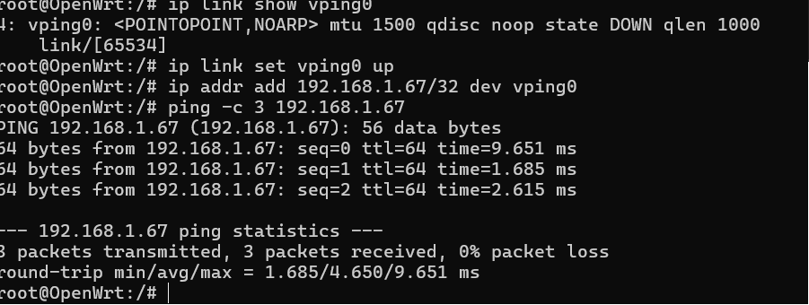
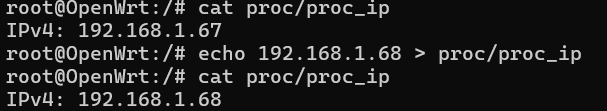
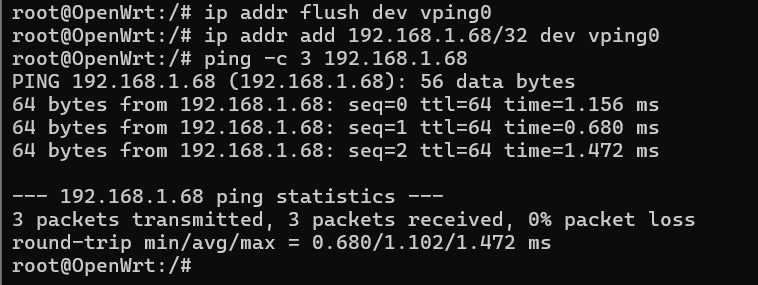

# vping kernel module for OpenWrt

Модуль создает виртуальный интерфейс `vping0` и отвечает на ICMP echo request
для IPv4-адреса, который хранится в `/proc/proc_ip`.

По умолчанию адрес берется из `inc/ping_config.h`.

## Структура

```text
.
|-- inc/ping_config.h   # дефолтный IP и объявления
|-- src/main.c          # init/exit модуля
|-- src/netif.c         # виртуальный netdev vping0
|-- src/proc_ip.c       # /proc/proc_ip read/write
|-- src/icmp.c          # старый netfilter-вариант, сейчас не собирается
|-- Makefile            # сборка через OpenWrt SDK
|-- bin/                # результат сборки, игнорируется git
`-- img/                # скриншоты для отчета
```

## Сборка

Нужен OpenWrt SDK той же версии и архитектуры, что и образ в QEMU.

В этом проекте использовался SDK:

```sh
openwrt-sdk-23.05.0-x86-64_gcc-12.3.0_musl.Linux-x86_64
```

Команды сборки выполнялись в Debian:

```sh
cd /mnt/d/owrt/module
make clean
make
ls -lh bin/ping_mod.ko
```

После сборки финальный модуль лежит в `bin/ping_mod.ko`, а временные файлы
компиляции находятся в `bin/tmp`.

## Готовый образ

В релиз добавлен готовый OpenWrt-образ:

```text
openwrt-23.05.0-x86-64-generic-ext4-combined.img
```

В этот образ уже интегрирован `ping_mod.ko`, поэтому его можно запускать в QEMU
без ручного копирования модуля через `scp`. После загрузки достаточно проверить,
что модуль загружен, появился интерфейс `vping0`, а `/proc/proc_ip` содержит
текущий IP.

```sh
lsmod | grep ping_mod
cat /proc/proc_ip
ip addr show vping0
ping -c 3 192.168.1.67
```

Если используется чистый образ без интегрированного модуля, выполните шаги ниже:
скопируйте `ping_mod.ko` через `scp`, загрузите его через `insmod` и настройте
`vping0` вручную.

## Запуск OpenWrt в QEMU

Из каталога `D:\owrt`:

```powershell
.\run.ps1
```

Или вручную:

```powershell
D:\qemu\qemu-system-x86_64.exe `
  -m 512 `
  -smp 1 `
  -drive file=openwrt-23.05.0-x86-64-generic-ext4-combined.img,format=raw `
  -net nic `
  -net user,hostfwd=tcp::2222-:22,hostfwd=tcp::8080-:80 `
  -vga std
```

## Копирование модуля в OpenWrt

Этот шаг нужен только для чистого образа, где `ping_mod.ko` еще не интегрирован.
После запуска QEMU модуль копируется в виртуальную машину через проброшенный
SSH-порт `2222`.

```sh
cd /mnt/d/owrt/module
scp -P 2222 bin/ping_mod.ko root@127.0.0.1:/tmp/ping_mod.ko
ssh -p 2222 root@127.0.0.1
```

Скриншот копирования модуля в OpenWrt:


## Загрузка и первая проверка

Внутри OpenWrt загрузите модуль:

```sh
insmod /tmp/ping_mod.ko
dmesg | tail
cat /proc/proc_ip
ip link show vping0
```

Поднимите интерфейс и назначьте дефолтный адрес:

```sh
ip link set vping0 up
ip addr add 192.168.1.67/32 dev vping0
ip addr show vping0
ping -c 3 192.168.1.67
```

Скриншот конфигурации `vping0` и успешного ping:



## Смена адреса через procfs

Адрес, на который отвечает модуль, можно изменить через `/proc/proc_ip`.

```sh
echo 192.168.1.68 > /proc/proc_ip
cat /proc/proc_ip
```

Скриншот смены IP в procfs:



## Переконфигурация vping0

После изменения `/proc/proc_ip` нужно обновить адрес на интерфейсе `vping0`.

```sh
ip addr flush dev vping0
ip addr add 192.168.1.68/32 dev vping0
ip addr show vping0
ping -c 3 192.168.1.68
```

Скриншот переконфигурации `vping0` и ping нового адреса:



## Автозагрузка в образе

Чтобы модуль грузился после перезагрузки QEMU, скопируйте его в каталог модулей
ядра и добавьте запись в `/etc/modules.d`.

Внутри OpenWrt:

```sh
KVER="$(uname -r)"
mkdir -p "/lib/modules/$KVER"
cp /tmp/ping_mod.ko "/lib/modules/$KVER/ping_mod.ko"
echo ping_mod > /etc/modules.d/80-ping_mod
```

Для автоматического поднятия `vping0` можно добавить init-скрипт:

```sh
cat > /etc/init.d/vping <<'EOF'
#!/bin/sh /etc/rc.common

START=95

start() {
	ip link set vping0 up
	IP="$(sed -n 's/^IPv4:[[:space:]]*//p' /proc/proc_ip | head -n 1)"
	[ -n "$IP" ] && ip addr add "$IP/32" dev vping0 2>/dev/null || true
}
EOF

chmod +x /etc/init.d/vping
/etc/init.d/vping enable
/etc/init.d/vping start
```

Проверка после перезагрузки:

```sh
reboot
```

После загрузки:

```sh
lsmod | grep ping_mod
cat /proc/proc_ip
ip addr show vping0
ping -c 3 192.168.1.68
```

## Удаление

Внутри OpenWrt:

```sh
/etc/init.d/vping stop 2>/dev/null || true
/etc/init.d/vping disable 2>/dev/null || true
rm -f /etc/init.d/vping
rm -f /etc/modules.d/80-ping_mod
rmmod ping_mod
rm -f "/lib/modules/$(uname -r)/ping_mod.ko"
```

## Скриншоты

В README используются четыре изображения из каталога `img`:

```text
img/1.png  # scp: копирование ping_mod.ko в OpenWrt
img/2.png  # настройка vping0 и ping 192.168.1.67
img/3.png  # смена адреса через /proc/proc_ip
img/4.png  # переконфигурация vping0 и ping 192.168.1.68
```
